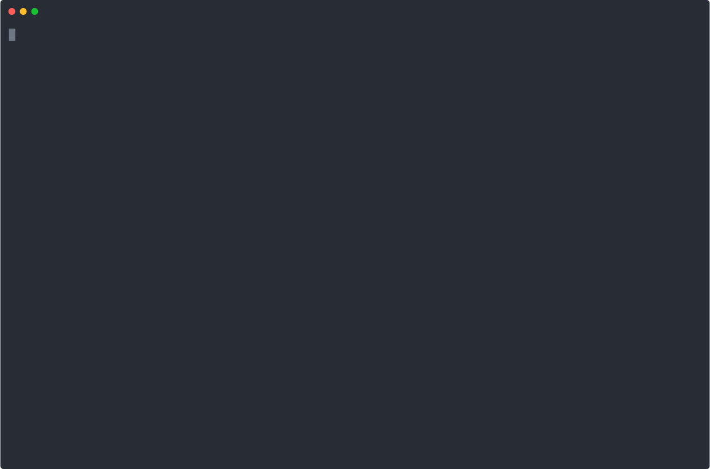

# TVL: The Tuned Variables Language

## LLM applications are under-specified

Teams still describe production AI systems with vague requests:

> *"Make it cheaper."*  
> *"Improve accuracy."*  
> *"Keep latency under control."*

Those requirements usually get translated into scattered prompt edits, hidden model switches, and one-off runtime flags. TVL turns that into a single, typed, reviewable specification.

<div class="grid cards" markdown>

-   :material-tune-variant: **Declare tuned variables explicitly**

    Capture models, prompts, routing policies, retrieval parameters, tool choices, and safety knobs as typed TVARs instead of ad-hoc config.

-   :material-shield-check: **Check feasibility before runtime**

    Validate types, domains, and structural constraints early, and reject contradictory or unsupported configurations before they reach production.

-   :material-chart-scatter-plot: **Gate promotion with evidence**

    Express objectives, effect sizes, multiple-testing policy, and chance constraints in one promotion contract.

-   :material-file-document-check: **Keep artifacts reproducible**

    Pin environment snapshots and evaluation sets so optimization, validation, and promotion decisions stay auditable.

</div>

## What TVL makes explicit

TVL is the contract boundary for governed adaptation in AI systems. A TVL module captures:

*   **Search space**: typed TVARs over primitive, enum, tuple, and callable domains
*   **Feasibility rules**: solver-friendly structural constraints over TVARs
*   **Operational assumptions**: environment snapshots with pinned bindings and numeric context for operational checks
*   **Optimization intent**: maximize/minimize objectives and banded targets
*   **Metric contract**: optional `metric_ref` pointers that tell the evaluator which metric definition computes each objective
*   **Promotion governance**: `epsilon_pareto`, `min_effect`, `adjust`, and `chance_constraints`
*   **Search budget**: strategy, convergence hints, and bounded exploration

## A Valid TVL Example

The example below mirrors the canonical `rag-support-bot.tvl.yml` module shipped in `spec/examples`:

```yaml title="rag-support-bot.tvl.yml"
tvl:
  module: corp.support.rag_bot

environment:
  snapshot_id: "2024-02-15T00:00:00Z"
  bindings:
    retriever: bm25-v3
    llm_gateway: us-east-1
  context:
    gateway_baseline_latency_ms: 180
    provider_input_price_usd_per_1k_tokens: 0.03

evaluation_set:
  dataset: s3://datasets/support-tickets/dev.jsonl
  seed: 2024

tvars:
  - name: model
    type: enum[str]
    domain: ["gpt-4o-mini", "gpt-4o", "llama3.1"]
  - name: temperature
    type: float
    domain:
      range: [0.0, 1.0]
      resolution: 0.05
  - name: retriever.k
    type: int
    domain:
      range: [0, 20]
  - name: zero_shot
    type: bool
    domain: [true, false]

constraints:
  structural:
    - when: zero_shot = true
      then: retriever.k = 0
  derived:
    - require: env.context.gateway_baseline_latency_ms <= 250
    - require: env.context.provider_input_price_usd_per_1k_tokens <= 0.05

objectives:
  - name: quality
    metric_ref: metrics.quality.v1
    direction: maximize
  - name: latency_p95_ms
    metric_ref: metrics.latency_p95_ms.v1
    direction: minimize

promotion_policy:
  dominance: epsilon_pareto
  alpha: 0.05
  min_effect:
    quality: 0.01
    latency_p95_ms: 50
  chance_constraints:
    - name: latency_slo
      threshold: 0.05
      confidence: 0.95

exploration:
  strategy:
    type: nsga2
  convergence:
    metric: hypervolume_improvement
    window: 5
    threshold: 0.01
  budgets:
    max_trials: 48
```

TVL also supports:

*   **Callable domains** such as `callable[RerankerProto]` with registry-backed lookup
*   **Banded objectives** using `TOST` for targets like acceptable response-length ranges
*   **Multiple-testing adjustment** with `none`, `bonferroni`, `holm`, or `BH`
*   **Overlay composition** and separate validation of config/measurement artifacts

When present, `metric_ref` is a stable declarative ID such as `metrics.latency_p95_ms.v1`. The evaluation harness resolves that ID to the concrete metric implementation.

Callable and registry-backed domains are supported by the current tooling, but they are linted as outside the formally verified subset.

## What formal specifications enable

TVL is the specification layer. It defines **what** may vary, **what** must hold, and **what** counts as improvement. That enables a full tooling stack on top.

### Automatic Optimization

<figure markdown>
  { loading=lazy }
  <figcaption>Formal specs turn configuration drift into a bounded optimization problem.</figcaption>
</figure>

### Spec Validation

<figure markdown>
  { loading=lazy }
  <figcaption>Validate schema, types, policy fields, and operational assumptions before rollout.</figcaption>
</figure>

### Constraint Satisfiability

<figure markdown>
  { loading=lazy }
  <figcaption>Check structural feasibility with SAT/SMT tooling before any expensive evaluation run begins.</figcaption>
</figure>

!!! note "TVL is the stable contract boundary"
    TVL sits between authoring front-ends, validation tooling, optimizer/runtime layers, and promotion workflows. In current Traigent materials, that means TVL remains the auditable governance contract even when other front-ends or runtimes sit around it.

## Get Started

Install the published package:

```bash
python -m pip install tvl-spec
```

Or install the SDK and CLI tools from this repository in editable mode:

```bash
python -m pip install -e tvl/[dev]
```

Validate one of the shipped examples end to end:

```bash
tvl-parse spec/examples/rag-support-bot.tvl.yml
tvl-lint spec/examples/rag-support-bot.tvl.yml
tvl-validate spec/examples/rag-support-bot.tvl.yml
tvl-check-structural spec/examples/rag-support-bot.tvl.yml --json
tvl-check-operational spec/examples/rag-support-bot.tvl.yml --json
```

---

<div class="grid cards" markdown>

-   :material-book-open-variant: **[Getting Started Guide](getting-started.md)**

    Write a first valid module and run the core CLI checks.

-   :material-file-document: **[Language Reference](reference/language.md)**

    Review the current TVL surface, including types, constraints, objectives, and promotion policy.

-   :material-code-braces: **[Example Walkthroughs](examples/walkthroughs.md)**

    Follow the canonical examples for RAG bots, routers, tool-use agents, validation fixtures, and overlays.

-   :material-text-box-search: **[Papers and Specs](PAPERS_AND_SPECS.md)**

    Browse the formal spec, arXiv manuscript, book artifacts, and supporting materials.

-   :material-github: **[Examples on GitHub](https://github.com/Traigent/tvl/tree/main/spec/examples)**

    Open the exact source files used by this site.

</div>

---

!!! info "Created by Traigent"
    TVL is developed by [Traigent](https://traigent.com). The current design and terminology on this site are aligned with the TVL schema, shipped examples, formal spec artifacts, and the latest Traigent research and publication materials in this repository.
