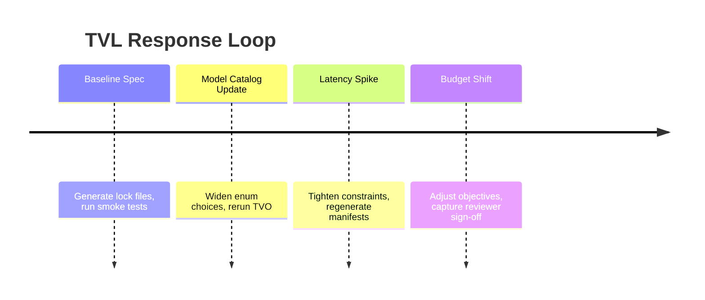

# Chapter 1 · Why TVL Exists

TVL grew out of a simple observation: **LLM applications never sit still**. Model catalogs evolve, latency budgets
oscillate with traffic spikes, and cost ceilings reset when finance reviews the bill. Hard-coded configuration
forces engineers to either over-provision permanently or ship blind during drift events. TVL reframes
configuration as a tuned, governed artifact that evolves alongside the environment.

## Design Goals at a Glance

- **Type-safe tuning variables** separate categorical choice from continuous ranges.
- **Deterministic exports** make generated files (such as `params.yaml`) reproducible in CI.
- **Declarative constraints** (typed DNF compiled to SAT/SMT) capture business and safety rules next to the numbers.
- **Governed promotion** requires proof—ε-Pareto dominance with statistical guarantees—before production changes roll out.

!!! example "Night-Before-Launch Scenario"
    The onboarding chatbot is hours away from orientation week. A new model release promises higher quality,
    but GPU latency just doubled. With TVL you keep the guardrails, tweak temperature and model ranges, and
    rerun TVO. The optimizer explores safely and promotes only when constraints hold—no frantic code edits.



## Running Example · Campus Orientation RAG

We revisit a retrieval-augmented system that answers student questions throughout the book. The workload is
quirky: traffic spikes during move-in, gateway latency shifts during registration surges, and provider prices drift
over time. This TVL file is the baseline we will extend.

```yaml
# Campus Orientation RAG - TVL Specification
tvl:
  module: campus.orientation.rag

# Environment snapshot anchors the spec to a point in time
environment:
  snapshot_id: "2025-01-15T00:00:00Z"
  bindings:
    retriever_index: campus-faq-v1
    llm_gateway: us-east-1
  context:
    gateway_baseline_latency_ms: 180
    provider_input_price_usd_per_1k_tokens: 0.03

# Evaluation dataset for optimization trials
evaluation_set:
  dataset: s3://datasets/faq/onboarding-v2.jsonl
  seed: 2025

# Tuned Variables (TVARs) - the parameters we optimize
tvars:
  - name: model
    type: enum[str]
    domain: ["gpt-4o-mini", "gpt-4o", "claude-3-haiku"]

  - name: temperature
    type: float
    domain:
      range: [0.1, 0.8]
      resolution: 0.05

  - name: max_tokens
    type: int
    domain:
      set: [256, 512, 768]

  - name: retrieval_depth
    type: int
    domain:
      range: [2, 6]

# Constraints: structural (checked before trials) and operational preconditions
constraints:
  structural:
    # Premium models need lower temperature for consistency
    - when: model = "gpt-4o"
      then: temperature <= 0.5
    # Deep retrieval requires more tokens
    - when: retrieval_depth >= 5
      then: max_tokens >= 512
  derived:
    # Operational preconditions on the declared environment context
    - require: env.context.gateway_baseline_latency_ms <= 250
    - require: env.context.provider_input_price_usd_per_1k_tokens <= 0.05

# Multi-objective optimization targets
objectives:
  - name: answer_quality
    metric_ref: metrics.answer_quality.v1
    direction: maximize
  - name: response_latency_p95_ms
    metric_ref: metrics.response_latency_p95_ms.v1
    direction: minimize
  - name: token_cost_usd
    metric_ref: metrics.token_cost_usd.v1
    direction: minimize

# Promotion policy with statistical guarantees
promotion_policy:
  dominance: epsilon_pareto
  alpha: 0.05
  adjust: holm
  min_effect:
    answer_quality: 0.02
    response_latency_p95_ms: 50
    token_cost_usd: 0.005
  chance_constraints:
    - name: latency_slo_violation_rate
      threshold: 0.05
      confidence: 0.95
    - name: toxicity_violation_rate
      threshold: 0.01
      confidence: 0.95
    - name: pii_violation_rate
      threshold: 0.001
      confidence: 0.95

# Exploration configuration
exploration:
  strategy:
    type: nsga2
  budgets:
    max_trials: 60
    max_wallclock_s: 2400
```

!!! info "Validate Your Spec"
    Download `/examples/rag-support-bot.tvl.yml` and run `tvl-validate rag-support-bot.tvl.yml` to check the spec against the TVL schema.
    The validator catches type mismatches, domain violations, and unsatisfiable constraints.

## Field Notes Legend

Throughout the interactive book you will see three callouts:

- **Hackathon Moves** — quick tips for rapid experimentation.
- **Reliability Pitfalls** — gotchas that often surface in incident reviews.
- **Integration Hints** — pointers linking a concept to Triagent (TVO) or DVL workflows.
