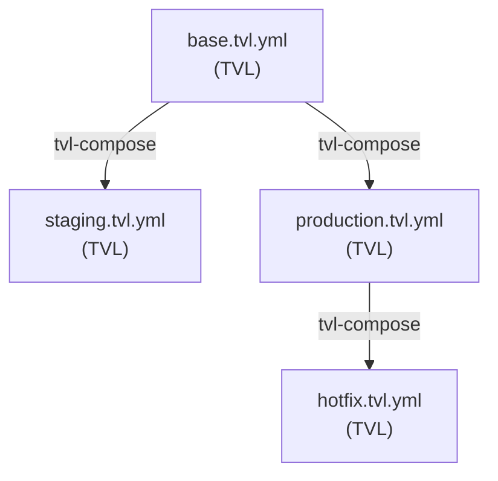

# Chapter 4 · Patterns for Real Deployments

Managing multiple environments (dev, staging, production) often requires slight variations of the same TVL
spec. This chapter covers module composition patterns using `tvl-compose`, a preprocessing tool that flattens
overlay files into valid TVL modules.

## Module Composition with tvl-compose

The TVL core schema defines standalone, self-contained modules. To support inheritance and overlays,
we use **preprocessing** rather than extending the core schema:

```text
base.tvl.yml + staging.overlay.yml  →  tvl-compose  →  staging.tvl.yml (valid TVL)
```

This keeps the core spec simple while enabling powerful composition patterns.

## Layered Specifications

**Base module** (valid TVL):

```yaml
# base.tvl.yml - full TVL module
tvl:
  module: corp.support.rag_bot

environment:
  snapshot_id: "2025-01-20T00:00:00Z"
  bindings:
    llm_gateway: us-east-1

evaluation_set:
  dataset: s3://datasets/book/overlays/base.jsonl
  seed: 2025

tvars:
  - name: model
    type: enum[str]
    domain: ["gpt-4o-mini", "gpt-4o", "claude-3-haiku"]
  - name: temperature
    type: float
    domain:
      range: [0.0, 1.0]
      resolution: 0.05
  - name: retriever.k
    type: int
    domain:
      range: [0, 20]

constraints:
  structural:
    - when: "retriever.k >= 12"
      then: "temperature <= 0.4"
  derived: []

objectives:
  - name: quality
    metric_ref: metrics.quality.v1
    direction: maximize
  - name: latency_p95_ms
    metric_ref: metrics.latency_p95_ms.v1
    direction: minimize
  - name: cost_usd
    metric_ref: metrics.cost_usd.v1
    direction: minimize

promotion_policy:
  dominance: epsilon_pareto
  alpha: 0.05
  adjust: holm
  min_effect:
    quality: 0.01
    latency_p95_ms: 50
    cost_usd: 0.001

exploration:
  strategy:
    type: nsga2
  budgets:
    max_trials: 200
    max_wallclock_s: 7200
```

**Staging overlay** (NOT a standalone TVL module):

```yaml
# staging.overlay.yml - requires preprocessing
_tvl_overlay:
  extends: ch4_base_module.tvl.yml

overrides:
  evaluation_set:
    dataset: s3://datasets/book/overlays/staging.jsonl
  tvars:
    - name: temperature
      domain:
        range: [0.0, 0.6]
        resolution: 0.05
  exploration:
    budgets:
      max_trials: 100  # Reduced for faster CI
      max_wallclock_s: 3600
```

**Compose to valid TVL:**

```bash
tvl-compose ch4_staging.overlay.yml -o staging.tvl.yml
tvl-validate staging.tvl.yml  # Passes!
```

## Visualizing Overlays



Each composed output is a valid, standalone TVL module. Overlays are inputs to the composition process,
not runtime artifacts.

## Override Rules

`tvl-compose` validates safe narrowing for the following:

| Override Type | Allowed | Not Allowed |
|--------------|---------|-------------|
| Enum domain | Remove values | Add new values |
| Numeric range | Narrow bounds | Widen bounds |
| Budget | Decrease | Increase beyond base |

!!! info "Current Validation Scope"
    The current implementation validates enum narrowing, range narrowing, and budget decreases.
    Resolution changes and constraint modifications are merged without validation—ensure your
    overlays follow safe narrowing practices for these fields.

## Hotfix Playbook

Need to react quickly to a vendor outage? Create a short-lived overlay:

```yaml
# hotfix-vendor-outage.overlay.yml
_tvl_overlay:
  extends: ch4_production.overlay.yml

overrides:
  tvars:
    - name: model
      domain: ["gpt-4o-mini"]  # Narrow to the safest known-good model
```

Compose and deploy:

```bash
tvl-compose hotfix-vendor-outage.overlay.yml -o hotfix.tvl.yml
tvl-validate hotfix.tvl.yml
# Deploy hotfix.tvl.yml
```

!!! pitfall "Avoid Configuration Drift"
    Never edit the base file for a temporary fix—create an overlay. This keeps history clean and makes it
    obvious which changes were incident driven versus long-term strategy.

## Provenance Matters

Every promotion should commit:

- `spec.tvl.yml` — the composed, valid TVL module.
- `spec.overlay.yml` — the overlay that produced it (if any).
- `provenance.json` — metadata: base SHA, overlay SHA, compose timestamp.

```json
{
  "base": "base.tvl.yml@abc123",
  "overlay": "staging.overlay.yml@def456",
  "composed_at": "2025-01-15T10:30:00Z",
  "composed_by": "ci-bot"
}
```

This audit trail enables deterministic recreation of exact configurations from version control history.
