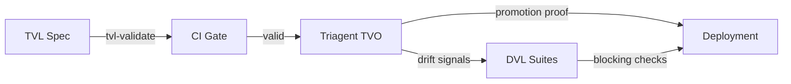

# Chapter 5 · Integration and Tooling

TVL earns its keep when paired with Triagent (TVO) and DVL. TVO reads TVL specs, explores the configuration
space, and produces promotion proofs. DVL validates the datasets that power those experiments so you never
ship a great configuration with stale data.



## TVL CLI Tools

The TVL toolchain provides focused CLI tools for validation and CI integration:

| Tool | Purpose |
|------|---------|
| `tvl-parse` | Parse YAML to JSON AST, basic syntax checking |
| `tvl-lint` | Normative lints: missing min_effect, duplicate TVARs, etc. |
| `tvl-validate` | JSON Schema + lint validation (combines parse + lint) |
| `tvl-check-structural` | SAT/SMT satisfiability of structural constraints |
| `tvl-check-operational` | Runtime validation of derived constraints and budgets |
| `tvl-config-validate` | Check a configuration assignment against spec domains |
| `tvl-measure-validate` | Validate measurements against spec + promotion policy |
| `tvl-ci-gate` | Dry-run promotion gate (stub for CI pipelines) |
| `tvl-compose` | Flatten overlay files into valid TVL modules |

### Quick Validation

```bash
# Validate schema and run lints
tvl-validate my-spec.tvl.yml

# Check structural constraints are satisfiable
tvl-check-structural my-spec.tvl.yml

# Full CI pipeline (validation only)
tvl-validate my-spec.tvl.yml && \
  tvl-check-structural my-spec.tvl.yml
```

### Configuration and Measurement Validation

```bash
# Validate a specific configuration against the spec
tvl-config-validate my-spec.tvl.yml config.yml

# Validate configuration + measurements for promotion gate
tvl-measure-validate my-spec.tvl.yml config.yml measurements.yml
```

## Deterministic Artifacts

Every TVL workflow produces deterministic artifacts for auditability:

- `spec.tvl.yml` — the validated TVL module
- `config.yml` — the promoted configuration assignment
- `measurements.yml` — evaluation results (metrics, sample sizes)
- `provenance.json` — metadata (timestamps, runners, environment snapshot)

## Field Notes · Replay the Optimization Story

The Orientation RAG lab includes the same presets we evaluate in CI. Jump between **Baseline**, **Latency Spike**,
and **Budget Shift** to see how TVO trades objectives while DVL enforces guardrails.

<iframe src="../../sims/orientation-rag-circuit/main.html#budget-shift" height="640px" scrolling="no" style="width: 100%; border: none;"></iframe>

- Compare the latency and cost read-outs before and after each preset.
- Click **Copy YAML** to capture the snapshot TVO would export.
- Note how the constraint badges align with promotion gates—green across the board before approving production.

!!! integration "CI Recipe"
    ```bash
    # 1. Validate the spec
    tvl-validate path/to/spec.tvl.yml

    # 2. Check constraints are satisfiable
    tvl-check-structural path/to/spec.tvl.yml

    # 3. Run optimization (Triagent)
    triagent optimize --spec path/to/spec.tvl.yml --output results/

    # 4. Validate promotion candidate
    tvl-measure-validate path/to/spec.tvl.yml results/config.yml results/measurements.yml

    # 5. Run promotion gate (compare incumbent vs candidate)
    tvl-ci-gate path/to/spec.tvl.yml results/incumbent.yml results/candidate.yml --json

    # 6. Data quality check (DVL)
    dvl validate suites/faq-orientation.json
    ```

## Manifests and Promotion

After a successful TVO run, Triagent emits a manifest bundling:

- Resolved spec SHA and artifact locations
- Validation logs from the CLI tools
- Promotion gate decision (pass/fail/defer)
- DVL drift checks (pass/fail with links)
- Rollback instructions if thresholds regress

Treat the manifest as a living audit trail. Every deployment should point to it.
