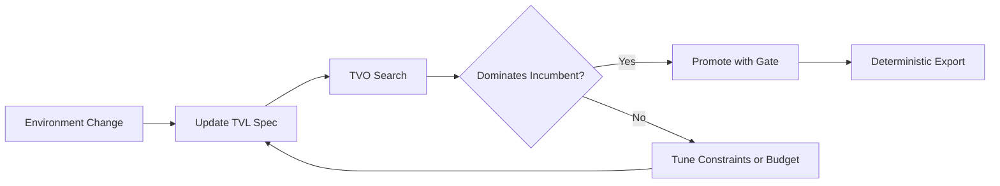

# TVL Intelligent Textbook

Welcome to the **Tuned Variable Language (TVL)** interactive guide. This learning path adapts the core TVL
book from Traigent Labs to the interactive framework provided by the Intelligent Textbooks project. You can
read chapters sequentially, explore examples in your editor, or remix the content into your own courseware.

!!! tip "How to Use This Track"
    1. Skim the chapter overviews to decide where to dive in.
    2. Open the linked code samples directly from the repository for hands-on practice.
    3. Re-run the exercise scripts to validate your understanding before moving on.

## Why TVL Matters

LLM applications operate in environments where models, latencies, and costs shift daily. TVL turns brittle
configuration files into governed, type-safe specifications that TVO (Traigent's optimizer) can explore
while respecting safety constraints. This textbook guides software engineering students through that mindset
shift—from hard-coded parameters to adaptive, auditable configuration for agents, services, and other LLM-backed workflows.

## Chapter Map

| Chapter | Focus | Key Artifacts |
|---------|-------|---------------|
| [Motivation](chapter-01-motivation.md) | Why prone-to-drift pipelines need TVL | Baseline campus RAG spec |
| [Language Basics](chapter-02-basics.md) | Anatomy of a TVL spec | Quickstart YAML + Python inspector |
| [Constraints & Units](chapter-03-constraints.md) | Declarative safety rails with CEL | Constraint lab spec + pytest |
| [Patterns](chapter-04-patterns.md) | Inheritance, overlays, and hotfixes | Environment tree + overlay YAML |
| [Integration](chapter-05-integration.md) | TVL with Triagent (TVO) and DVL | Deployment manifest + CI script |
| [Resources](resources.md) | Commands, references, and next steps | Tooling cheat sheet |
| [Hands-on Labs](labs.md) | Run Traigent examples aligned with the chapters | Hello World, Tradeoffs, Guardrails |
| [Guided Walkthrough](walkthrough.md) | Step-by-step SDK tour | `walkthrough.sh` script |
| [Playground](playground.md) | Streamlit control center for experiments | Problem manager + visualizations |

## Hands-On Materials

- **Primary specs** live in `tvl_book/examples/*.tvl.yml`
- **Helper scripts** sit beside each spec (look for `.py` or `.sh` neighbors)
- **Deployment assets** flow through `tvl_book/examples/ch5_*`

You can open these files in your IDE and run the scripts locally while following the chapters.

## Tooling Overview

All validation and linting runs through the `tvl` CLI, which is built from modular plug-ins. Scan the
[Resources](resources.md) page for a command cheat sheet, then wire the modules (`tvl_parse`, `tvl_validate`,
`tvl_check_structural`, and friends) into your local scripts or CI pipeline. Triagent consumes the same
reports before promoting a configuration, so mastering the tooling keeps surprises out of production.
